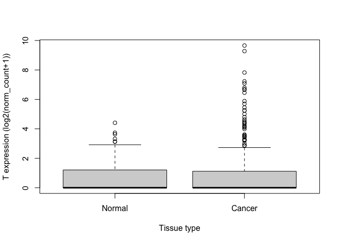
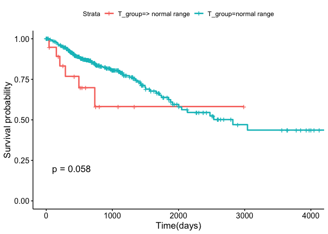
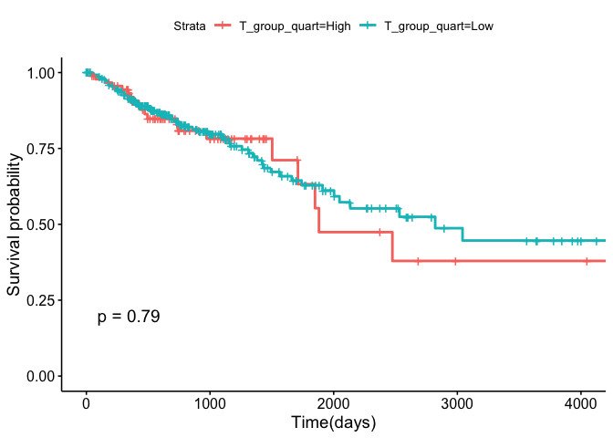
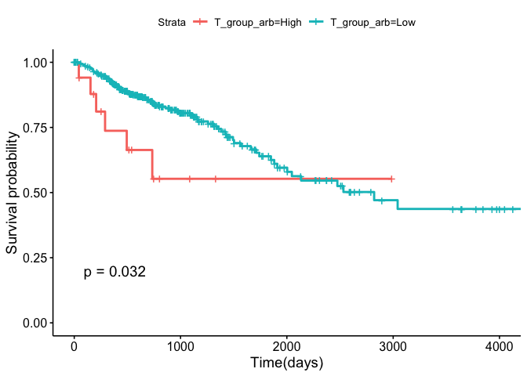
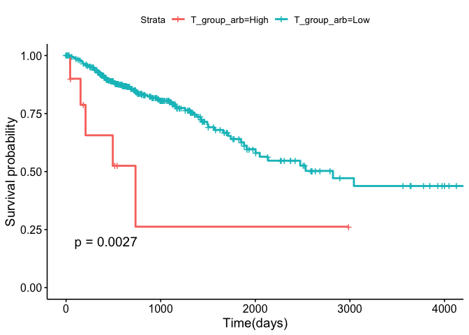

KM plots based on TBXT mRNA levels
================
Helena
08/09/2020

## Preparation for analysis

Load the data and store it in an object ‘samples’. The data I am using
was downloaded from the UCSC Xena project. It combines RNASeq data from
TCGA (cancer tissues) and GTex (normal tissues) via a common
bioinformatics pipeline - so you can directly compare values from both
studies.

``` r
samples <- 
  read.delim("~/Desktop/crc_prognosis/tcga_target_gtex_colorectal.tsv", 
             header=TRUE)
```

Load required packages

``` r
library(survival)
library(survminer)
library(dplyr)
library(forcats)
```

## Summary and boxplot

Summarise numbers of samples of each type in the dataset. We are only
interested in ‘Primary tumor’(which comes from the TCGA dataset) and
‘Normal Tissue’ (GTex) for the following analyses.

(I have decided not to include the ‘Solid Tissue Normal’ samples in the
following analyses. These are from the TCGA and are normal samples
adjacent to some of the tumor samples as opposed to from non-cancer
patients and therefore not independent data points. I should do a
boxplot of these vs their primary tumor counterparts though.)

``` r
count(samples, X_sample_type)
```

    ##         X_sample_type   n
    ## 1          Metastatic   1
    ## 2       Normal Tissue 308
    ## 3       Primary Tumor 380
    ## 4     Recurrent Tumor   2
    ## 5 Solid Tissue Normal  51

This is a boxplot summarising TBXT mRNA levels in normal colon tissue
(GTex) vs primary colorectal adenoma.

``` r
normal <- filter(samples, X_sample_type == "Normal Tissue")
cancer <- filter(samples, X_sample_type == "Primary Tumor")
boxplot(normal$T, cancer$T,
        at = c(1,2),
        names = c("Normal", "Cancer"),
        xlab = "Tissue type",
        ylab = "T expression (log2(norm_count+1))")
```

<!-- -->

As you can see from the boxplot although the majority of samples in both
datasets are similarly distributed with no/ low TBXT mRNA, the cancer
dataset has more outliers that exhibit higher TBXT expression.

## Survival analyses (Kaplan Meier plots)

These analyses define a high Brachyury group and a low Brachyury group,
look at the relative survival of those groups then test for a
significant different in survival using a logrank test. You get
different results depending on how you define the groups. Here I go
through what the results are for lots of different definitions.

## Above the max normal value

The max value for TBXT expression in the normal tissues (top dot in the
boxplot) is:

``` r
max(normal$T)
```

    ## [1] 4.411

If we define ‘High Brachyury’ to be \> 4.411 the analysis looks like
this.

``` r
cancer <- cancer %>% 
  mutate(T_group = ifelse(T > 4.4110, "> normal range","normal range"))
cancer$T_group <- factor(cancer$T_group)
surv_object <- Surv(time = cancer$OS.time, event = cancer$OS)
fit1 <- survfit(surv_object ~ T_group, data = cancer)
ggsurvplot(fit1, data = cancer, pval = TRUE, xlab = "Time(days)")
```

<!-- -->

There appears to be a difference between the groups but it narrowly
misses significance in the log-rank test. This table shows the number of
people in each group and the number of ‘events’ (by which it means
death).

``` r
fit1
```

    ## Call: survfit(formula = surv_object ~ T_group, data = cancer)
    ## 
    ##    3 observations deleted due to missingness 
    ##                          n events median 0.95LCL 0.95UCL
    ## T_group=> normal range  19      6     NA     734      NA
    ## T_group=normal range   358     79   2821    2003      NA

## Top quartile (25%)

When we define ‘High Brachyury’ as the top quartile the analysis is as
follows. Find top quartile:

``` r
summary(cancer$T)
```

    ##    Min. 1st Qu.  Median    Mean 3rd Qu.    Max. 
    ##  0.0000  0.0000  0.0000  0.8551  1.1160  9.6580

Make the Kaplan-Meier plot:

``` r
cancer <- cancer %>% 
  mutate(T_group_quart = ifelse(T >= 1.1160, "High","Low"))
cancer$T_group_quart <- factor(cancer$T_group_quart)
surv_object <- Surv(time = cancer$OS.time, event = cancer$OS)
fit1 <- survfit(surv_object ~ T_group_quart, data = cancer)
ggsurvplot(fit1, data = cancer, pval = TRUE, xlab = "Time(days)")
```

<!-- -->

``` r
fit1
```

    ## Call: survfit(formula = surv_object ~ T_group_quart, data = cancer)
    ## 
    ##    3 observations deleted due to missingness 
    ##                      n events median 0.95LCL 0.95UCL
    ## T_group_quart=High  93     20   1881    1711      NA
    ## T_group_quart=Low  284     65   2821    2047      NA

There is no difference between the groups. I don’t think this is
particularly suprising because lots of these samples have TBXT values
well within the range of the normal tissues.

## Arbitary cut-offs

So, starting from the cut-off of 4.4110 what happens if we bump the
cut-off upwards slightly? First to 4.5.

``` r
cancer <- cancer %>% 
  mutate(T_group_arb = ifelse(T > 4.5, "High","Low"))
cancer$T_group_arb <- factor(cancer$T_group_arb)
surv_object <- Surv(time = cancer$OS.time, event = cancer$OS)
fit1 <- survfit(surv_object ~ T_group_arb, data = cancer)
ggsurvplot(fit1, data = cancer, pval = TRUE, xlab = "Time(days)")
```

<!-- -->

``` r
fit1
```

    ## Call: survfit(formula = surv_object ~ T_group_arb, data = cancer)
    ## 
    ##    3 observations deleted due to missingness 
    ##                    n events median 0.95LCL 0.95UCL
    ## T_group_arb=High  18      6     NA     494      NA
    ## T_group_arb=Low  359     79   2821    2003      NA

This loses only 1 patient from the high group and the results are now
significant.

Using 4.6 as a cut-off we ‘lose’ one more patient from the ‘High’ group
and it looks like this:

``` r
cancer <- cancer %>% 
  mutate(T_group_arb = ifelse(T > 4.6, "High","Low"))
cancer$T_group_arb <- factor(cancer$T_group_arb)
surv_object <- Surv(time = cancer$OS.time, event = cancer$OS)
fit1 <- survfit(surv_object ~ T_group_arb, data = cancer)
ggsurvplot(fit1, data = cancer, pval = TRUE, xlab = "Time(days)")
```

<!-- -->

``` r
fit1
```

    ## Call: survfit(formula = surv_object ~ T_group_arb, data = cancer)
    ## 
    ##    3 observations deleted due to missingness 
    ##                    n events median 0.95LCL 0.95UCL
    ## T_group_arb=High  17      6     NA     494      NA
    ## T_group_arb=Low  360     79   2821    2003      NA

There is a more significant difference between the groups.

If I do this for lots of different arbitary cutoffs (between high and
low Brachyury) - the P value changes as follows:

| Cut-off | P value | n  | Events |
| :------ | :------ | :- | :----- |
| 4.411   | 0.58    | 19 | 6      |
| 4.5     | 0.042   | 18 | 6      |
| 4.6     | 0.032   | 17 | 6      |
| 4.7     | 0.12    | 16 | 5      |
| 4.8     | 0.078   | 15 | 5      |
| 5.1     | 0.056   | 14 | 5      |
| 5.3     | 0.02    | 12 | 5      |
| 5.5     | 0.0075  | 11 | 5      |
| 5.7     | 0.0027  | 10 | 5      |
| 5.9     | 0.026   | 9  | 4      |
| 6.5     | 0.16    | 8  | 3      |
| 6.7     | 0.39    | 6  | 2      |

The cutoff which gives the lowest P value is 5.7 and the plot looks like
this.

``` r
cancer <- cancer %>% 
  mutate(T_group_arb = ifelse(T > 5.7, "High","Low"))
cancer$T_group_arb <- factor(cancer$T_group_arb)
surv_object <- Surv(time = cancer$OS.time, event = cancer$OS)
fit1 <- survfit(surv_object ~ T_group_arb, data = cancer)
ggsurvplot(fit1, data = cancer, pval = TRUE, xlab = "Time(days)")
```

<!-- -->

``` r
fit1
```

    ## Call: survfit(formula = surv_object ~ T_group_arb, data = cancer)
    ## 
    ##    3 observations deleted due to missingness 
    ##                    n events median 0.95LCL 0.95UCL
    ## T_group_arb=High  10      5    734     206      NA
    ## T_group_arb=Low  367     80   2821    2003      NA

## Conclusion

There does seem to be a difference in prognosis between patients with
\>normal and normal levels of TBXT mRNA. The observation of a difference
seems to be robust at many different cut-offs, but the level of
statistical significance varies depending on the cut-off.
